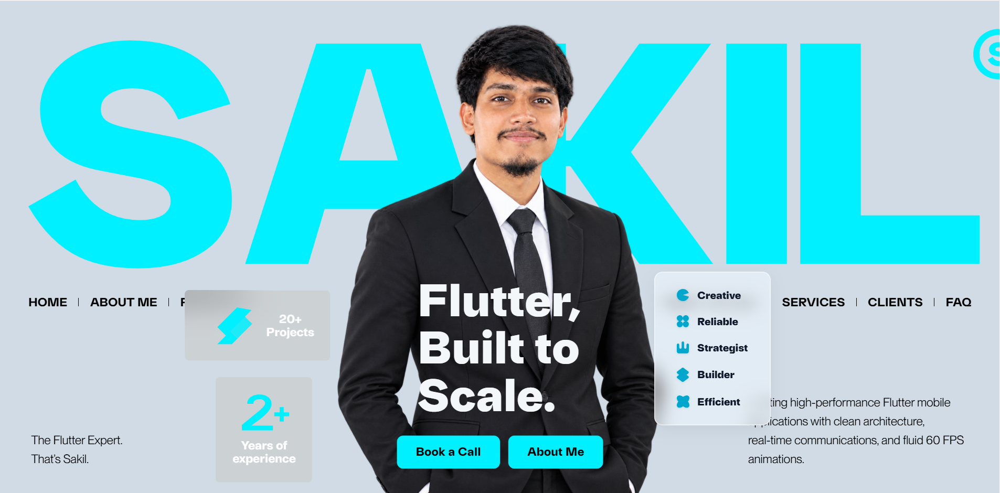

  <!-- Main Hero Banner -->
  

    
  

   

  <!-- Website Style Navigation Bar -->
  

    
    
    
    
    
    
  

 

---

### 👤 ABOUT ME

<table border="0" width="100%">
  <tr>
    <td width="60%" valign="top">
      
Results-driven <b>Flutter Mobile Application Developer</b> with hands-on experience building production-ready mobile applications for real-world business needs. Proficient in <b>Flutter, Dart, GetX, Firebase, REST API integration, payment gateways, push notifications, and real-time communication systems</b>.

      
Successfully delivered <b>9+ end-to-end applications</b> while collaborating directly with clients, gathering requirements, and transforming complex business ideas into scalable, high-performance mobile products.

      <ul>
        <li>🚀 <b>Core Stack:</b> Flutter, Dart, Clean Architecture, REST APIs</li>
        <li>🧩 <b>State Management:</b> GetX, Provider, BLoC</li>
        <li>💳 <b>Payment Solutions:</b> Stripe, Google Pay, Apple Pay, In-App Purchases</li>
        <li>⚡ <b>Real-Time Tech:</b> WebSockets, Firebase Cloud Messaging (FCM), Real-Time Chat</li>
        <li>🎯 <b>Career Goal:</b> Seeking global/remote software engineering opportunities to build impactful mobile apps.</li>
      </ul>
    </td>
    <td width="40%" align="center" valign="top">
      

        <h3>⚡ KEY HIGHLIGHTS</h3>
        

        

        

        

        

      

    </td>
  </tr>
</table>

---

### 🛠️ TECH STACK & ARCHITECTURE

  
<b>Languages & Core Frameworks</b>

  

    

  
<b>Backend, Cloud & Database</b>

  
   
  
  
  
  

    

  
<b>State Management & Architecture</b>

  
  
  
  
  

    

  
<b>Payment Gateways & Real-Time Systems</b>

  
  
  
  
  
  

    

  
<b>Development Tools & Deployment</b>

  
   
  
  

---

### 🤖 AI-ASSISTED DEVELOPMENT & PRODUCTIVITY

<table border="0" width="100%">
  <tr>
    <td width="50%" valign="top">
      <h4>⚡ Rapid AI Workflows</h4>
      <ul>
        <li><b>AI-Assisted Software Engineering:</b> Leveraging LLMs for architectural design, code generation, and test automation.</li>
        <li><b>Prompt Engineering:</b> Crafting targeted prompts for rapid prototyping and clean code structuring.</li>
        <li><b>Multi-LLM Mastery:</b> Utilizing <code>ChatGPT</code>, <code>Gemini</code>, and <code>Claude</code> to accelerate project timelines by 3x.</li>
      </ul>
    </td>
    <td width="50%" valign="top">
      <h4>💡 Efficiency & Quality Assurance</h4>
      <ul>
        <li><b>Software Requirement Analysis:</b> Automated extraction of system requirements & documentation using AI.</li>
        <li><b>AI-Enhanced Debugging:</b> Instant root-cause identification and memory leak detection.</li>
        <li><b>Technical Content & Docs:</b> Auto-generating clean API specs and developer handbooks.</li>
      </ul>
    </td>
  </tr>
</table>

---

### 💼 PROFESSIONAL EXPERIENCE

> 📱 **Flutter Mobile Application Developer | Freelance Software Developer**  
> 🗓️ **November 2025 – Present** &nbsp;|&nbsp; 📍 **Remote / Global Clients**

- 📦 **End-to-End Delivery:** Built and delivered **9+ production mobile applications** from initial requirements gathering to App Store & Play Store deployment.
- 🤝 **Client Collaboration:** Worked directly with international clients to define technical scope, UX flows, and scalable architecture.
- 💳 **Payment Integration:** Integrated global payment gateways including **Stripe, Google Pay, Apple Pay, and In-App Purchases**.
- 💬 **Real-Time Communication:** Implemented live chat engines, WebSockets, and real-time data sync for multi-user platforms.
- 🔔 **Push Notifications:** Integrated Firebase Cloud Messaging (FCM) for user engagement, order tracking, and dynamic alerts.
- 🛠️ **Production Optimization:** Maintained, refactored, and tuned existing production applications for high performance and low latency.

---

### 🚀 FEATURED PROJECTS

<table border="0" width="100%">
  <tr>
    <td width="50%" valign="top">
      

        <h3>📖 Quran International</h3>
        
<i>Multilingual Quran Application</i>

        
Features audio recitations, multi-language translations, bookmarking, and an intuitive reading interface for global users.

        

          
          
          
        

      

    </td>
    <td width="50%" valign="top">
      

        <h3>🔴 Live Stream App</h3>
        
<i>Real-Time Live Streaming Platform</i>

        
Features interactive audience engagement, secure authentication, live chat, instant FCM notifications, and scalable streaming.

        

          
          
          
        

      

    </td>
  </tr>
  <tr>
    <td width="50%" valign="top">
      

        <h3>🍽️ Restaurant Booking System</h3>
        
<i>Reservation Management Platform</i>

        
Enables customers to discover restaurants, view real-time table availability, reserve dining tables, and manage booking schedules.

        

          
          
          
        

      

    </td>
    <td width="50%" valign="top">
      

        <h3>💼 Job Booking System</h3>
        
<i>On-Demand Service Marketplace</i>

        
Connects clients with skilled service professionals featuring instant booking, dynamic scheduling, and secure payment processing.

        

          
          
          
        

      

    </td>
  </tr>
</table>

---

### 🎓 EDUCATION, TRAINING & REFERENCE

<table border="0" width="100%">
  <tr>
    <td width="50%" valign="top">
      <h4>🎓 Education</h4>
      
<b>TMSS Polytechnic Institute, Rangpur</b> 
      📜 Diploma in Computer Science & Technology

      <h4>📜 Industrial Training</h4>
      
<b>Flutter App Development</b> 
      Mastered Flutter & Dart from fundamentals to advanced mobile engineering, building practical production applications across the complete software development lifecycle.

    </td>
    <td width="50%" valign="top">
      <h4>👤 Professional Reference</h4>
      
<b>M A Mazedul Islam</b> 
      Senior Flutter Developer, <i>SpondonIT</i> 
      📞 Phone: <a href="tel:+8801770554970">+8801770554970</a> 
      ✉️ Email: <a href="mailto:mazedulislam4970@gmail.com">mazedulislam4970@gmail.com</a>

    </td>
  </tr>
</table>

---

### 📊 PERFORMANCE & GITHUB STATS

  <table border="0">
    <tr>
      <td>
        
      </td>
      <td>
        
      </td>
    </tr>
  </table>

   

  <!-- Interactive Activity Graph -->
  

---

  
  
<i>💡 "Code is like humor. When you have to explain it, it’s bad." – Cory House</i>

   

  <!-- Footer Banner -->
  

